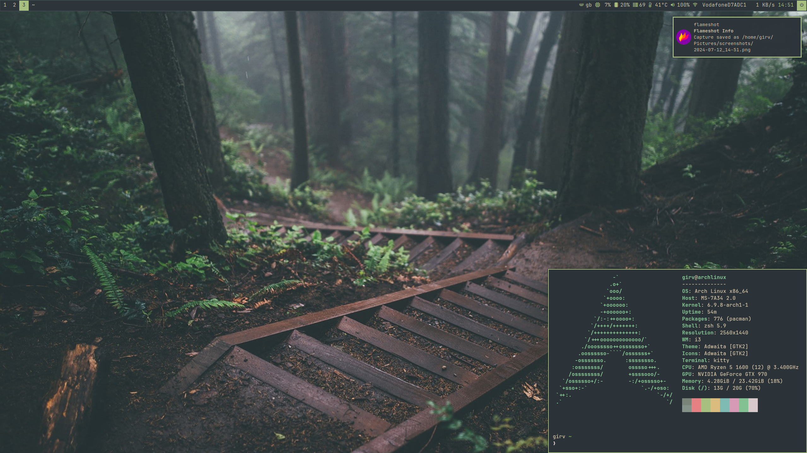

# Girv's Dotfiles

My current (work in progress) Arch-i3 configuration. Colours based on [Everforest](https://github.com/sainnhe/everforest) theme for Vim.


## Information



- **OS:** [Arch Linux](https://archlinux.org)
- **WM:** [i3-gaps (Now merged with i3)](https://github.com/Airblader/i3)
- **Terminal:** [kitty](https://github.com/kovidgoyal/kitty)
- **Bar:** [polybar](https://github.com/polybar/polybar)
- **Shell:** [zsh](https://www.zsh.org/)
- **Compositor:** [picom](https://github.com/yshui/picom)
- **Editor:** [Neovim](https://github.com/neovim/neovim) / [VSCode](https://github.com/microsoft/vscode)
- **Application Launcher:** [rofi](https://github.com/davatorium/rofi)
- **Notification Deamon:** [dunst](https://github.com/dunst-project/dunst)


## Installation
*TODO: Install script*

### Target Structure
```
~/
├── .config
│   ├── dunst
│   │   └── dunstrc
│   ├── i3
│   │   └── config
│   ├── kitty
│   │   └── kitty.conf
│   ├── nvim
│   │   ├── plugins
│   │   │   └── ...
│   │   ├── themes
│   │   │   └── ...
│   │   ├── init.lua
│   │   └── lazy-lock.json 
│   ├── picom
│   │   └── picom.conf
│   ├── polybar
│   │   ├── config.ini
│   │   └── launch.sh
│   ├── rofi
│   │   ├── themes
│   │   │   └── squared-everforest.rasi
│   │   └── config.rasi
│   ├── zsh
│   │   ├── aliases.txt
│   │   └── (zsh-syntax-highlighting)
│   └── betterlockscreenrc
├── .local
│   └── bin
│       ├── powermenu
│       └── wifimenu
├── .xinitrc
└── .zshrc
```

### Programs/Packages Needed 

- Betterlockscreen
- Dunst
- Expac (see zsh aliases)
- ImageMagick
- Feh
- i3
- Kitty
- Network Manager
- Nvim
- Picom
- Pipewire
- Polybar
- Ranger (Optional)
- Rofi
- Zsh
    - zsh-syntax-highlighting

### Fonts

- JetBrainsMono Nerd Font
- Sarasa Mono (Fallback with CJK support)
